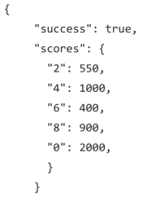
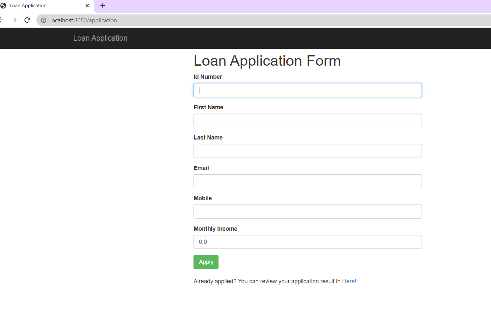

# Loan Application System

### About The Project
___
Simple loan application management system

This project is about taking loan application from user or admin which later system will be saving application to database, 
and after calculating loan according to following rules system will be save it to database. 

* New users can be defined in the system, existing users can be updated or deleted.
* Completed loan application can only be queried with an ID number.

### Loan Calculation Rules
___
1. It'll be assumed that this system has Credit Score Service which will return following credit scores according to the last digit of ID number.
   1. If ID number ends with an odd number will be assumed inaccurate.
   2.  

      
2. If credit score is below 500 points, the loan application result will be Rejected.
 
 
3. If credit score is between 500 points and 1000 points 
   1. And if the monthly income is below 5000TL, the loan application of the user is approved and limit will be set to 10.000TL. Loan application result will be Approved.
   2. Or if the monthly income is above 5000TL, the loan application of the user is approved and limit will be set to 20.000TL. Loan application result will be Approved.
 
 
4. If the credit score is equal or above 1000 points, the loan application of the user is approved and limit will be set to (Monthly Income) * (Credit Limit Multiplier)TL. Loan application result will be Approved.
   * The credit Limit Multiplier is set to 4 by default.

### Used Technologies
___
* Java 1.8
* Spring Boot 2.7.2
* Maven
* ThymeLeaf
* Spring Framework(Spring MVC)
* Springdata JPA(Hibernate)
* Swagger2

 

### Simple UI Example 
___

